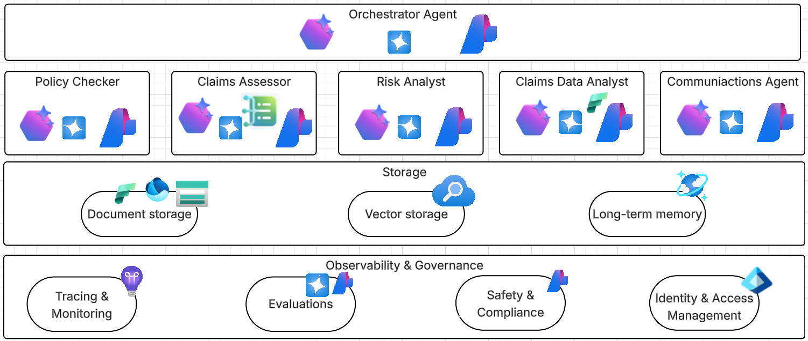

# Contoso Claims - Multi-Agent Insurance Claims Platform

> **⚠️ Demonstration Project**: This is a demonstration application showcasing the capabilities of Azure AI Foundry, Azure Content Understanding, and multi-agent architectures. It is not intended for production use without significant hardening, security review, and enterprise-grade implementation practices.

## Original Source

This project is based on the [Insurance Multi-Agent Demo](https://github.com/alisoliman/insurance-multi-agent). It has been enhanced with **Azure AI Agent Service** integration and Content Understanding.

We also referenced the [Content Processing Solution Accelerator](https://github.com/microsoft/content-processing-solution-accelerator) for implementing document processing and Azure Content Understanding integration.

## Overview

An **Agentic AI Claims Demo** powered by advanced multi-agent systems leveraging **Azure AI Agent Service** and **Azure OpenAI (GPT-4.1-mini)**, designed to streamline and enhance the end-to-end insurance claims process. This implementation showcases a cutting-edge architecture where specialized AI agents collaboratively assess claims, delivering instant, transparent, and explainable recommendations directly to claims processors. By augmenting human decision-making, the solution significantly accelerates claim handling—reducing processing time from hours to minutes—while enhancing consistency, transparency, and customer satisfaction.

## What This Demo Showcases

### Multi-Agent Architecture with Azure AI Agent Service
Unlike traditional single-model AI systems, Contoso Claims employs a **collaborative multi-agent approach** powered by **Azure AI Agent Service**, where specialized AI agents work together:

- **Claim Assessor Agent** - Analyzes damage photos, evaluates repair costs, and validates claim consistency
- **Policy Checker Agent** - Verifies coverage terms, searches policy documents, and determines claim eligibility  
- **Risk Analyst Agent** - Detects fraud patterns, analyzes claimant history, and assesses risk factors
- **Communication Agent** - Generates personalized customer emails and requests missing documentation
- **Supervisor Agent** - Orchestrates the workflow and synthesizes final recommendations

### Azure AI Agent Service Integration
This implementation leverages **Azure AI Foundry's Agent Service** for production-grade agent orchestration:

- **Managed Agent Lifecycle** - Automatic deployment and management of agents in Azure AI Foundry
- **Function Calling** - Native tool integration with automatic execution via FunctionTool and ToolSet
- **Thread-based Conversations** - Persistent conversation threads for complex multi-turn interactions
- **Agent Reusability** - Smart agent discovery prevents duplicate deployments across restarts
- **Fallback Architecture** - Graceful degradation to LangGraph implementation when Azure agents unavailable

### Agent Behaviors & Capabilities

#### Claim Assessor
- **Multimodal Analysis**: Processes damage photos using Azure OpenAI LLMs with vision Capabilities
- **Cost Validation**: Cross-references repair estimates with vehicle specifications
- **Documentation Review**: Evaluates completeness of supporting evidence
- **Damage Assessment**: Provides detailed analysis of incident consistency

#### Policy Checker  
- **Coverage Verification**: Searches policy documents using semantic similarity
- **Multi-language Support**: Handles both English and Dutch insurance policies
- **Exclusion Analysis**: Identifies policy limitations and coverage gaps
- **Intelligent Search**: Uses vector embeddings for accurate policy matching

#### Risk Analyst
- **Fraud Detection**: Analyzes patterns indicative of fraudulent claims
- **History Analysis**: Reviews claimant's previous claim patterns
- **Risk Scoring**: Provides quantitative risk assessments
- **Red Flag Identification**: Highlights suspicious claim elements

#### Communication Agent
- **Personalized Messaging**: Crafts contextual customer communications
- **Missing Document Requests**: Generates specific requests for additional evidence
- **Professional Tone**: Maintains appropriate insurance industry language
- **Template Generation**: Creates reusable communication templates

## Architecture

### Technology Stack
- **Multi-Agent Framework**: Azure AI Agent Service with LangGraph fallback
- **Agent Orchestration**: Azure AI Foundry project-based deployment
- **AI Provider**: Azure OpenAI (GPT-4o, GPT-4.1-mini)
- **Backend**: FastAPI with async/await patterns
- **Frontend**: Next.js 15 with React 19 and shadcn/ui
- **Search**: FAISS vector database for policy retrieval
- **Infrastructure**: Azure Container Apps
- **Authentication**: Azure DefaultAzureCredential (Azure CLI, Managed Identity)

### High-Level Architecture



```
┌─────────────────────────────────────────────────────────────────┐
│                         Client Layer                            │
│  Next.js Frontend (React 19 + shadcn/ui) - Port 3000            │
└───────────────────────────┬─────────────────────────────────────┘
                            │ HTTP/REST
┌───────────────────────────▼─────────────────────────────────────┐
│                    FastAPI Backend - Port 8000                  │
│  ┌────────────────────────────────────────────────────────────┐ │
│  │              API Layer (v1 Endpoints)                      │ │
│  │  /workflow/sample-claims  /agent/{name}/run                │ │
│  └────────────────────┬───────────────────────────────────────┘ │
│                       │                                         │
│  ┌────────────────────▼───────────────────────────────────────┐ │
│  │           Azure Agent Manager (Startup)                    │ │
│  │  - Deploy agents to Azure AI Foundry on startup            │ │
│  │  - Check for existing agents (prevent duplicates)          │ │
│  │  - Store agent IDs for routing                             │ │
│  └────────────────────┬───────────────────────────────────────┘ │
│                       │                                         │
│  ┌────────────────────▼───────────────────────────────────────┐ │
│  │         Single Agent Service (Routing Logic)               │ │
│  │  if Azure Agent Available: use Azure AI Agent Service      │ │
│  │  else: fallback to LangGraph implementation                │ │
│  └─────┬──────────────────────────────────────────────────────┘ │
└────────┼────────────────────────────────────────────────────────┘
         │
         ├──────────────────┬──────────────────┐
         │                  │                  │
┌────────▼─────────┐ ┌──────▼────────┐ ┌──────▼──────────┐
│ Azure AI Agent   │ │   LangGraph   │ │  Policy Search  │
│    Service       │ │    Fallback   │ │   (FAISS)       │
│                  │ │               │ │                 │
│ - Agent Threads  │ │ - Local Exec  │ │ - Vector Store  │
│ - Function Call  │ │ - react_agent │ │ - Embeddings    │
│ - Auto Execution │ │               │ │                 │
└────────┬─────────┘ └───────────────┘ └─────────────────┘
         │
         │ Deployed in Azure AI Foundry
┌────────▼──────────────────────────────────────────────────────┐
│              Azure AI Foundry Project                         │
│                                                               │
│  ┌─────────────────┐  ┌──────────────────┐  ┌──────────────┐  │
│  │ Claim Assessor  │  │  Policy Checker  │  │Risk Analyst  │  │
│  │  Agent          │  │  Agent           │  │  Agent       │  │
│  │                 │  │                  │  │              │  │
│  │ Tools:          │  │ Tools:           │  │ Tools:       │  │
│  │ - get_vehicle   │  │ - get_policy     │  │ - get_claim  │  │
│  │ - analyze_image │  │ - search_docs    │  │   _history   │  │
│  └─────────────────┘  └──────────────────┘  └──────────────┘  │
│                                                               │
│  ┌─────────────────────────────────────────────────────────┐  │
│  │          Communication Agent                            │  │
│  │          (No tools - pure language model)               │  │
│  └─────────────────────────────────────────────────────────┘  │
└───────────────────────────────────────────────────────────────┘
                          │
                          │ Uses
                          ▼
┌───────────────────────────────────────────────────────────────┐
│                   Azure OpenAI Service                        │
│  Model: gpt-5 / gpt-4.1-mini                                  │
│  API Version: 2024-08-01-preview                              │
└───────────────────────────────────────────────────────────────┘
```

## Key Features

### Azure AI Agent Service Integration
- **Managed Agent Deployment**: Agents automatically deployed to Azure AI Foundry on startup
- **Agent Reusability**: Smart discovery prevents duplicate agent creation across restarts
- **Native Function Calling**: Tools registered via FunctionTool with automatic execution
- **Thread-Based Conversations**: Persistent conversation threads for complex interactions
- **Graceful Fallback**: Automatic fallback to LangGraph when Azure agents unavailable

### Core Capabilities
- **Real-time Agent Collaboration**: Watch agents work together in live workflows
- **Explainable AI**: Full transparency into agent reasoning and decision paths
- **Document Intelligence**: PDF processing and semantic search across policies
- **Multimodal Processing**: Image analysis for damage assessment using Azure OpenAI vision
- **Interactive Demos**: Individual agent testing and complete workflow simulation
- **Azure AI Evaluation**: Automatic evaluation of workflow responses using Azure AI Foundry evaluation SDK
  - Groundedness, relevance, coherence, and fluency metrics
  - Evaluation results stored in Cosmos DB
  - View evaluation scores directly in the UI
- **Production Ready**: Deployed on Azure with enterprise security and managed identity

## Development Setup

### Prerequisites
- Python 3.12+
- Node.js 18+
- [uv](https://github.com/astral-sh/uv) for Python dependency management
- Azure OpenAI account
- Azure AI Foundry project (for Azure AI Agent Service)
- Azure Content Understanding resource with custom analyzer (for document processing)
- Azure CLI (`az login` for authentication)

### Environment Configuration

Create a `.env` file in the `backend/` directory by copying the sample:

```bash
cd backend
cp .env.sample .env
```

Then edit `.env` with your Azure resource details. See `backend/.env.sample` for all required configuration variables including:
- Azure OpenAI credentials and endpoints
- Azure AI Foundry project details
- Azure Storage, AI Search, and Cosmos DB configuration  
- Service principal authentication
- Application Insights telemetry settings

### Azure Resources Required

The application requires the following Azure resources:

1. **Azure OpenAI Service**: For LLM and embedding models
   - Deployments: `gpt-4o` / `gpt-4.1-mini`, `text-embedding-3-large`
   - API version: `2024-08-01-preview`

2. **Azure AI Foundry Project**: For Azure AI Agent Service
   - Manages 4 specialized agents (Claim Assessor, Policy Checker, Risk Analyst, Communication Agent)
   - Handles agent lifecycle and function calling

3. **Azure Storage Account**: For document storage
   - Container: `insurance-documents` (auto-created)
   - Stores uploaded policy documents, regulations, and reference materials
   - Provides SAS token-based secure access

4. **Azure AI Search**: For semantic document search
   - Index: `insurance-policies` (auto-created)
   - Vector search enabled with HNSW algorithm
   - Dimensions: 3072 (for text-embedding-3-large)
   - Supports hybrid search (vector + keyword)

5. **Azure Cosmos DB**: For agent persistence and telemetry
   - Database: `insurance-agents`
   - Containers: `agent-definitions`, `agent-executions`, `token-usage`
   - Partition keys: `/agent_type`, `/execution_id`, `/execution_id`
   - Tracks agent workflows, execution history, and token usage

6. **Azure Content Understanding**: For automated claim form processing
   - Custom analyzer: `contoso-claim` (trained on insurance claim forms)
   - API version: `2025-05-01-preview`
   - Extracts 19+ fields including policyholder info, dates, amounts, and damaged items
   - Processes PDF, PNG, JPG, JPEG, and TIFF formats

### Azure Content Understanding Setup

The Document Analyzer page uses Azure Content Understanding to automatically extract structured data from insurance claim forms. You need to create and train a custom analyzer before using this feature.

#### Creating a Custom Analyzer

1. **Navigate to Azure AI Foundry**:
   - Go to Azure AI Foundry
   - Select Content Understanding

2. **Create Custom Document Model**:
   - Click "Custom extraction models"
   - Choose "Build a custom model"
   - Select "Template" for form-based documents
   - Name: `contoso-claim`

3. **Upload Training Documents**:
   - Use the sample claim forms in `docs/sample-claims/`:
     - `ClaimForm_1.pdf` through `ClaimForm_7.pdf` (printed forms)
     - `claimform_handwritten_1.pdf` (handwritten form)
   - Upload at least 5 documents for optimal training

4. **Define Field Schema**:
   - Use the schema provided in `docs/cu-contoso-claims_prebuilt-documentAnalyzer_2025-05-01.json`
   - This includes 19 fields and 1 table:
     - **Text fields**: policyholder names, policy number, claim number, addresses, cause of loss, loss description
     - **Date fields**: policy dates, loss date, date prepared, signature date
     - **Number fields**: deductible amount, phone number
     - **Table**: damaged_items (with columns for item name, description, date acquired, cost, repair cost)

5. **Label Training Documents**:
   - For each uploaded document, mark the locations of all fields
   - Ensure consistent labeling across documents
   - Include the damaged items table in at least 3 documents

6. **Train the Model**:
   - Click "Train" to start the training process
   - Wait for training to complete (typically 5-10 minutes)
   - Review the model performance metrics

7. **Deploy the Analyzer**:
   - After training, deploy the model as `contoso-claim`
   - Copy the analyzer ID and endpoint details
   - Update your `.env` file with:
     ```
     AZURE_CONTENT_UNDERSTANDING_ENDPOINT=https://your-resource.cognitiveservices.azure.com
     AZURE_CONTENT_UNDERSTANDING_KEY=your-key
     AZURE_CONTENT_UNDERSTANDING_ANALYZER_ID=contoso-claim
     ```

#### Testing the Analyzer

After deployment, you can test the analyzer using the Document Analyzer page:
1. Navigate to **Documents → Document Analyzer** in the application
2. Upload one of the sample claim forms from `docs/sample-claims/`
3. Verify that all fields and tables are extracted correctly
4. Expected results:
   - 19 fields extracted with 100% confidence
   - 1 table (damaged_items) with multiple rows
   - Document uploaded to Azure Storage and indexed in AI Search

### Cosmos DB Setup

The application requires Azure Cosmos DB for NoSQL to persist agent definitions, execution history, and token usage telemetry.

#### Creating Cosmos DB Resources

**Option 1: Using Azure Portal**

1. **Create Cosmos DB Account**:
   - Navigate to [Azure Portal](https://portal.azure.com)
   - Click "Create a resource" → "Azure Cosmos DB"
   - Select "Azure Cosmos DB for NoSQL"
   - Choose your subscription and resource group
   - Account name: `your-cosmos-account-name`
   - Location: Same as your other Azure resources
   - Capacity mode: **Serverless** (recommended for development)
   - Click "Review + create"

2. **Create Database and Containers**:
   
   After the account is created, navigate to "Data Explorer" in your Cosmos DB account:

   **Create Database**:
   - Click "New Database"
   - Database id: `insurance-agents`
   - Leave "Provision throughput" unchecked (containers will manage their own)
   - Click "OK"

   **Create Container: agent-definitions**:
   - Click "New Container"
   - Database id: Select "Use existing" → `insurance-agents`
   - Container id: `agent-definitions`
   - Partition key: `/agent_type`
   - Click "OK"

   **Create Container: agent-executions**:
   - Click "New Container"
   - Database id: Select "Use existing" → `insurance-agents`
   - Container id: `agent-executions`
   - Partition key: `/execution_id`
   - Click "OK"

   **Create Container: token-usage**:
   - Click "New Container"
   - Database id: Select "Use existing" → `insurance-agents`
   - Container id: `token-usage`
   - Partition key: `/execution_id`
   - Click "OK"

   **Create Container: evals**:
   - Click "New Container"
   - Database id: Select "Use existing" → `insurance-agents`
   - Container id: `evals`
   - Partition key: `/evaluation_id`
   - Click "OK"


#### Permissions and Access Control

**Using Azure CLI Authentication (Development)**:

The application uses `DefaultAzureCredential` which supports Azure CLI authentication:

```bash
# Login with Azure CLI
az login

# Assign yourself Cosmos DB Data Contributor role
az cosmosdb sql role assignment create \
  --account-name $ACCOUNT_NAME \
  --resource-group $RESOURCE_GROUP \
  --role-definition-name "Cosmos DB Built-in Data Contributor" \
  --principal-id $(az ad signed-in-user show --query id -o tsv) \
  --scope "/"
```

**Using Managed Identity (Production)**:

For Azure Container Apps or other Azure services:

```bash
# Get the managed identity principal ID (for Container App)
PRINCIPAL_ID=$(az containerapp show \
  --name your-app-name \
  --resource-group $RESOURCE_GROUP \
  --query identity.principalId -o tsv)

# Assign Cosmos DB Data Contributor role to managed identity
az cosmosdb sql role assignment create \
  --account-name $ACCOUNT_NAME \
  --resource-group $RESOURCE_GROUP \
  --role-definition-name "Cosmos DB Built-in Data Contributor" \
  --principal-id $PRINCIPAL_ID \
  --scope "/"
```

**Firewall Configuration**:

By default, Cosmos DB denies all network access. You need to configure network access:

**Development (allow your local IP)**:
```bash
# Get your public IP
MY_IP=$(curl -s https://api.ipify.org)

# Add your IP to firewall
az cosmosdb update \
  --name $ACCOUNT_NAME \
  --resource-group $RESOURCE_GROUP \
  --ip-range-filter $MY_IP
```

**Production (allow Azure services)**:
```bash
# Allow access from Azure services
az cosmosdb update \
  --name $ACCOUNT_NAME \
  --resource-group $RESOURCE_GROUP \
  --enable-public-network true \
  --enable-automatic-failover false
```

**Note**: No connection string or key is needed when using `DefaultAzureCredential` with RBAC permissions.

### Authentication for Azure AI Agent Service

The application uses `DefaultAzureCredential` for authentication. Authenticate via Azure CLI:

```bash
az login
```

This enables the application to:
- Deploy agents to Azure AI Foundry
- Execute agent runs with function calling
- Manage agent lifecycle (create, reuse, delete)

### Backend Setup

Install dependencies:
```bash
cd backend
uv venv
uv pip install -r pyproject.toml
```

Ensure you're authenticated with Azure CLI:
```bash
az login
```

Start the backend server:
```bash
uv run fastapi dev
```

The API will be available at http://localhost:8000

### Document Management with Azure

The application uses Azure Blob Storage and AI Search for document management:

**Upload Documents**:
- Documents are uploaded to Azure Blob Storage (not local filesystem)
- Organized in containers: `policy/`, `regulation/`, `reference/`
- Each document receives a unique blob name with metadata

**Indexing**:
- Documents are automatically indexed in Azure AI Search
- Text is split into 1000-character chunks with 200-character overlap
- Each chunk is embedded using `text-embedding-3-large` (3072 dimensions)
- Vector search uses HNSW algorithm for fast similarity search

**Search**:
- Semantic search combines vector similarity and keyword matching
- Results include source attribution and policy section references
- Configurable score thresholds filter low-quality matches


### Frontend Setup

```bash
cd frontend
npm install --legacy-peer-deps
npm run dev
```

The frontend will be available at http://localhost:3000


## Azure Deployment

### Prerequisites
- [Azure Developer CLI (azd)](https://docs.microsoft.com/en-us/azure/developer/azure-developer-cli/)
- Azure subscription with appropriate permissions

### Deploy to Azure Container Apps
```bash
# Login to Azure
azd auth login

# Initialize and deploy
azd up
```

This will:
1. Create Azure Container Apps environment
2. Set up container registry with managed identity
3. Deploy both frontend and backend containers
4. Configure networking and CORS policies
5. Output the deployed application URLs

### Infrastructure
The deployment creates:
- **Container Apps Environment** with consumption-based scaling
- **Azure Container Registry** for image storage
- **Managed Identity** for secure registry access
- **Log Analytics Workspace** for monitoring
- **HTTPS endpoints** with automatic SSL certificates

## Demo Scenarios

### Individual Agent Testing
- `/agents/claim-assessor` - Test damage photo analysis with vehicle detail extraction
- `/agents/policy-checker` - Verify coverage scenarios with multilingual support (Dutch/English)
- `/agents/risk-analyst` - Fraud detection demos with claimant history analysis
- `/agents/communication-agent` - Professional email generation

### Complete Workflow
- Go to `/demo` for end-to-end claim processing
- Upload damage photos and watch multimodal analysis
- See agents collaborate in real-time via Azure AI Foundry
- Review final assessment with full reasoning chains

### Sample Claims
The system includes realistic test scenarios:
- Standard auto collision claim (CLM-001)
- High-value vehicle damage
- Dutch language insurance claim
- High-risk fraud scenario (CLM-002)

## License

MIT License - see LICENSE file for details.
