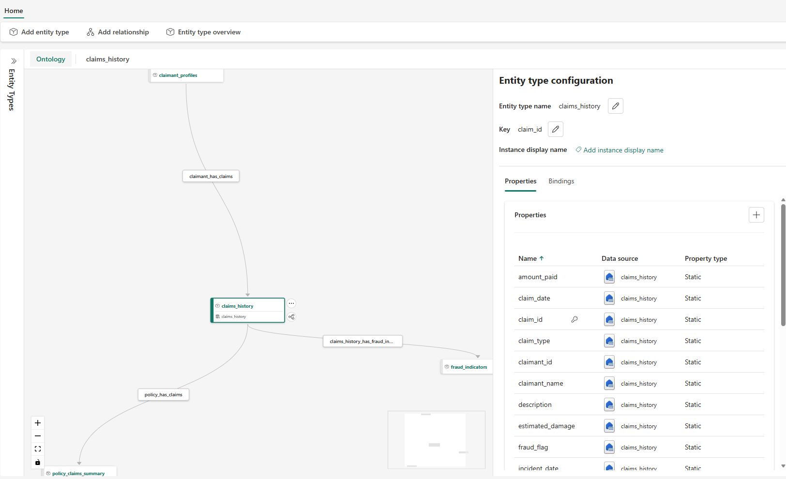

# Fabric IQ Ontology Configuration Guide

This guide provides step-by-step instructions for configuring your Insurance Claims ontology in Microsoft Fabric IQ.

---

## Ontology Relationship Diagram

```
┌─────────────────────────────────────────────────────────────────────────────────────┐
│                          INSURANCE CLAIMS ONTOLOGY                                  │
└─────────────────────────────────────────────────────────────────────────────────────┘

    ┌──────────────────────┐
    │  claimant_profiles   │
    │  ══════════════════  │
    │  [PK] claimant_id    │
    │  • name              │
    │  • age               │
    │  • state             │
    │  • city              │
    │  • risk_score        │
    │  • credit_score      │
    │  • driving_record    │
    │  • total_claims_count│
    │  • account_status    │
    │  • customer_since    │
    └──────────┬───────────┘
               │
               │ claimant_has_claims (1:Many)
               │ JOIN: claimant_id → claimant_id
               ▼
    ┌──────────────────────┐         ┌──────────────────────┐
    │   claims_history     │◄────────│ policy_claims_summary│
    │  ══════════════════  │         │  ═══════════════════ │
    │  [PK] claim_id       │         │  [PK] policy_number  │
    │  • policy_number     │         │  • total_claims      │
    │  • claimant_id       │         │  • total_amount_paid │
    │  • claim_type        │         │  • avg_claim_amount  │
    │  • estimated_damage  │         │  • claims_trend      │
    │  • amount_paid       │         │  • fraud_claims_count│
    │  • claim_date        │         └──────────────────────┘
    │  • incident_date     │              ▲
    │  • settlement_date   │              │ policy_has_claims (1:Many)
    │  • status            │              │ JOIN: policy_number → policy_number
    │  • state             │──────────────┘
    │  • fraud_flag        │
    └──────────┬───────────┘
               │
               │ claims_history_has_fraud_indicators (1:Many)
               │ JOIN: claim_id → claim_id
               ▼
    ┌────────────────────────┐
    │  fraud_indicators      │
    │  ══════════════════    │
    │  [PK] indicator_id     │
    │  • claim_id (FK)       │
    │  • indicator_type      │
    │  • severity            │
    │  • detected_date       │
    │  • pattern_description │
    │  • investigation_status│
    └────────────────────────┘

    ┌──────────────────────┐
    │ regional_statistics  │     (standalone - no relationship to claims)
    │  ══════════════════  │     Query directly for regional analysis
    │  [PK] state + city   │
    │  • region            │
    │  • avg_claim_amount  │
    │  • fraud_rate        │
    │  • claim_frequency   │
    │  • seasonal_peak     │
    └──────────────────────┘

    ═══════════════════════════════════════════════════════════════
    LEGEND:
    [PK] = Primary Key
    FK = Foreign Key
    ──► = Relationship direction (parent → child)
    ═══════════════════════════════════════════════════════════════
```

### Fabric IQ Ontology Screenshot



---

## Step-by-Step Configuration Instructions

### Prerequisites
- Access to Microsoft Fabric workspace
- Data already loaded into Lakehouse tables
- Fabric IQ resource created

### Your Lakehouse Structure
```
LH_AIClaimsDemo
 +-- Tables
 |   +-- dbo
 |       +-- claimant_profiles
 |       +-- claims_history
 |       +-- fraud_indicators
 |       +-- policy_claims_summary
 |       +-- regional_statistics
 +-- Files
     +-- claims_data
```

---

### Step 1: Add Missing Entity Type - `claimant_profiles`

1. **Navigate to your Fabric IQ resource** → Select "Ontology" tab
2. Click **"+ Add entity type"** button
3. **Select Data Source:**
   - Source type: **Lakehouse**
   - Lakehouse: **LH_AIClaimsDemo**
   - Schema: **dbo**
   - Table: **claimant_profiles**
4. Configure the entity:

   | Setting | Value |
   |---------|-------|
   | Entity type name | `claimant_profiles` |
   | Key | `claimant_id` |

5. Click **"Add"** to create the entity - Fabric will auto-import all columns as properties

6. **Verify imported properties** match these expected columns:

   | Property Name | Data Type | Notes |
   |---------------|-----------|-------|
   | `claimant_id` | String | **Set as Key** |
   | `name` | String | |
   | `age` | Integer | |
   | `state` | String | |
   | `city` | String | |
   | `address` | String | |
   | `phone` | String | |
   | `email` | String | |
   | `customer_since` | Date | |
   | `total_claims_count` | Integer | |
   | `total_claims_amount` | Decimal | |
   | `average_claim_amount` | Decimal | |
   | `risk_score` | Decimal | |
   | `claim_frequency` | String | |
   | `credit_score` | String | |
   | `driving_record` | String | |
   | `policy_count` | Integer | |
   | `account_status` | String | |

---

### Step 2: Verify Existing Entity Configurations

For each existing entity, verify it's connected to **LH_AIClaimsDemo.dbo.[table_name]**

#### 2.1 Verify `claims_history` Entity

1. Select `claims_history` from Entity Types list
2. Confirm these properties are configured:

   | Property Name | Key? | Notes |
   |---------------|------|-------|
   | `claim_id` | ✅ YES | Primary key |
   | `policy_number` | | FK to policy_claims_summary |
   | `claimant_id` | | FK to claimant_profiles |
   | `claimant_name` | | Denormalized for display |
   | `claim_type` | | Categorical |
   | `estimated_damage` | | Numeric/Currency |
   | `amount_paid` | | Numeric/Currency |
   | `claim_date` | | Date - Mark as temporal |
   | `incident_date` | | Date - Mark as temporal |
   | `settlement_date` | | Date - Mark as temporal |
   | `status` | | Categorical |
   | `location` | | Text |
   | `state` | | FK to regional_statistics |
   | `description` | | Text |
   | `police_report` | | Boolean |
   | `photos_provided` | | Boolean |
   | `witness_statements` | | Text/Numeric |
   | `vehicle_vin` | | Text (nullable) |
   | `vehicle_make` | | Text (nullable) |
   | `vehicle_model` | | Text (nullable) |
   | `vehicle_year` | | Numeric (nullable) |
   | `license_plate` | | Text (nullable) |
   | `fraud_flag` | | Boolean |

#### 2.2 Verify `fraud_indicators` Entity

1. Select `fraud_indicators` from Entity Types list
2. Confirm these properties:

   | Property Name | Key? | Notes |
   |---------------|------|-------|
   | `indicator_id` | ✅ YES | Primary key |
   | `claim_id` | | FK to claims_history |
   | `indicator_type` | | Categorical |
   | `severity` | | Categorical (LOW/MEDIUM/HIGH/CRITICAL) |
   | `detected_date` | | Date |
   | `pattern_description` | | Text |
   | `investigation_status` | | Categorical (OPEN/CLOSED/CONFIRMED) |

#### 2.3 Verify `policy_claims_summary` Entity

   | Property Name | Key? | Notes |
   |---------------|------|-------|
   | `policy_number` | ✅ YES | Primary key |
   | `total_claims` | | Numeric |
   | `total_amount_paid` | | Numeric/Currency |
   | `avg_claim_amount` | | Numeric/Currency |
   | `last_claim_date` | | Date |
   | `first_claim_date` | | Date |
   | `claims_trend` | | Categorical |
   | `policy_type` | | Categorical |
   | `fraud_claims_count` | | Numeric |

#### 2.4 Verify `regional_statistics` Entity

   | Property Name | Key? | Notes |
   |---------------|------|-------|
   | `state` | ✅ YES | Part of composite key |
   | `city` | ✅ YES | Part of composite key (or just use state) |
   | `region` | | Categorical |
   | `avg_claim_amount` | | Numeric/Currency |
   | `claim_frequency` | | Numeric |
   | `fraud_rate` | | Numeric/Percentage |
   | `most_common_claim_type` | | Categorical |
   | `seasonal_peak` | | Categorical |
   | `total_claims` | | Numeric |
   | `year` | | Numeric |

---

### Step 3: Create Relationships

#### 3.1 Create `claimant_has_claims` Relationship

1. Click **"+ Add relationship"** in the Ontology tab
2. Configure:

   | Setting | Value |
   |---------|-------|
   | Relationship name | `claimant_has_claims` |
   | From entity | `claimant_profiles` |
   | To entity | `claims_history` |
   | Cardinality | One-to-Many |

3. Define the join:
   - From property: `claimant_id`
   - To property: `claimant_id`

4. Click **"Add"**

#### 3.2 Create `policy_has_claims` Relationship

1. Click **"+ Add relationship"**
2. Configure:

   | Setting | Value |
   |---------|-------|
   | Relationship name | `policy_has_claims` |
   | From entity | `policy_claims_summary` |
   | To entity | `claims_history` |
   | Cardinality | One-to-Many |

3. Define the join:
   - From property: `policy_number`
   - To property: `policy_number`

4. Click **"Add"**

#### 3.3 Verify `claims_history_has_fraud_indicators` Relationship

This relationship should already exist based on your screenshot. Verify:

| Setting | Value |
|---------|-------|
| Relationship name | `claims_history_has_fraud_indicators` |
| From entity | `claims_history` |
| To entity | `fraud_indicators` |
| Cardinality | One-to-Many |
| Join | `claim_id` → `claim_id` |

#### 3.4 `claims_in_region` Relationship - SKIPPED

**Note**: This relationship is skipped because:
- `regional_statistics` has a composite key (`state` + `city`)
- `claims_history` doesn't have a separate `city` column (only combined `location`)
- The relationship would effectively be many-to-many, which is not well-supported

**Alternative**: Query `regional_statistics` directly for regional analysis rather than traversing from claims.

---

### Step 4: Add Computed Bindings

Bindings allow you to create derived/computed properties that enhance natural language queries.

#### 4.1 Add Bindings to `claims_history`

Navigate to `claims_history` → **Bindings** tab

| Binding Name | Expression Type | Expression | Purpose |
|--------------|-----------------|------------|---------|
| `is_high_value_claim` | Conditional | `estimated_damage > 25000` | Flag expensive claims |
| `has_complete_documentation` | Conditional | `police_report = true AND photos_provided = true` | Documentation quality |
| `is_auto_claim` | Conditional | `claim_type LIKE '%Auto%' OR claim_type LIKE '%Collision%'` | Auto claim filter |
| `days_since_incident` | Calculated | `DATEDIFF(day, incident_date, GETDATE())` | Claim age |
| `is_settled` | Conditional | `status IN ('APPROVED', 'SETTLED', 'CLOSED')` | Settlement status |

#### 4.2 Add Bindings to `claimant_profiles`

Navigate to `claimant_profiles` → **Bindings** tab

| Binding Name | Expression Type | Expression | Purpose |
|--------------|-----------------|------------|---------|
| `is_high_risk` | Conditional | `risk_score > 70` | Risk flagging |
| `is_vip_customer` | Conditional | `total_claims_amount > 50000 AND account_status = 'ACTIVE'` | VIP identification |
| `needs_review` | Conditional | `risk_score > 50 AND total_claims_count > 5` | Review queue |
| `tenure_category` | Conditional | `CASE WHEN DATEDIFF(year, customer_since, GETDATE()) > 5 THEN 'Long-term' WHEN DATEDIFF(year, customer_since, GETDATE()) > 2 THEN 'Established' ELSE 'New' END` | Customer tenure |

#### 4.3 Add Bindings to `fraud_indicators`

Navigate to `fraud_indicators` → **Bindings** tab

| Binding Name | Expression Type | Expression | Purpose |
|--------------|-----------------|------------|---------|
| `is_critical_priority` | Conditional | `severity IN ('HIGH', 'CRITICAL')` | Priority escalation |
| `needs_investigation` | Conditional | `investigation_status = 'OPEN'` | Active cases |
| `is_confirmed_fraud` | Conditional | `investigation_status = 'CONFIRMED'` | Confirmed fraud |

---

### Step 5: Configure Synonyms (Optional but Recommended)

Add synonyms to help natural language understanding:

#### Entity Synonyms
| Entity | Synonyms |
|--------|----------|
| `claimant_profiles` | customers, policyholders, clients, insureds |
| `claims_history` | claims, incidents, cases, claim records |
| `fraud_indicators` | fraud flags, fraud alerts, suspicious activity |
| `policy_claims_summary` | policies, policy records, coverage |
| `regional_statistics` | regions, locations, geographic data |

#### Property Synonyms
| Property | Synonyms |
|----------|----------|
| `estimated_damage` | claim amount, damage amount, cost, value |
| `risk_score` | risk level, risk rating, risk assessment |
| `fraud_flag` | fraudulent, suspicious, fraud indicator |
| `settlement_date` | resolved date, closed date, paid date |

---

### Step 6: Test Your Ontology

After configuration, test with these sample queries:

#### Basic Queries
```
"Show me all claims for claimant CLM-001"
"List fraud indicators with HIGH severity"
"What is the average claim amount in California?"
```

#### Relationship Queries
```
"Show all claims and their fraud indicators for policy POL-2025-914"
"Which customers have more than 5 claims?"
"List all fraud indicators for claims filed by high-risk customers"
```

#### Binding Queries
```
"Show me all high-value claims that are still pending"
"Find customers who need review"
"List all critical priority fraud cases that need investigation"
```

---

## Troubleshooting

### Common Issues

| Issue | Solution |
|-------|----------|
| Relationship not working | Verify join columns have matching data types |
| Binding returns errors | Check syntax matches your SQL dialect |
| Entity not appearing | Ensure table exists in Lakehouse and is refreshed |
| Queries return no results | Check data exists and filters aren't too restrictive |

### Validation Checklist

- [ ] All 5 entity types created
- [ ] All properties mapped correctly
- [ ] 3 relationships configured (claimant_has_claims, policy_has_claims, claims_history_has_fraud_indicators)
- [ ] Key bindings added
- [ ] Synonyms configured (optional)
- [ ] Test queries working

---

## Next Steps

1. **Add instance display names** - Configure how entities appear in results
2. **Set up semantic model** - For Power BI integration
3. **Configure permissions** - Set up row-level security if needed
4. **Monitor usage** - Review query patterns to optimize ontology

---

*Last Updated: January 2026*
