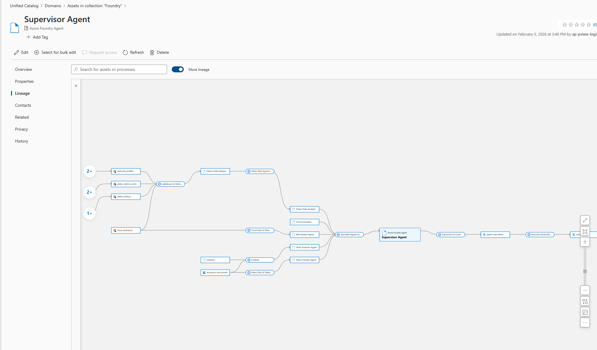

# 08 - Custom Lineage via REST API

This document covers creating custom data lineage in Microsoft Purview for the Insurance Claims Multi-Agent application.

> **Implementation**: See [scripts/create_lineage.py](scripts/create_lineage.py) for the complete automation script.

---

## Overview

### Why Custom Lineage?

While Purview auto-captures lineage for many Azure services, you need custom lineage for:
- AI/ML agent pipelines not natively supported
- Cross-service connections (Lakehouse → Fabric Data Agent → Foundry Agents)
- Application-level data flows (Agents → Cosmos DB)

### Lineage in Purview Portal



### Lineage Architecture

```
┌─────────────────────────────────────────────────────────────────────────────────────────────────┐
│                           INSURANCE CLAIMS DATA LINEAGE                                         │
└─────────────────────────────────────────────────────────────────────────────────────────────────┘

                                    DATA INGESTION LAYER
┌─────────────────────────────────────────────────────────────────────────────────────────────────┐
│                                                                                                 │
│  [Azure Storage]                      [Fabric Pipeline]              [Lakehouse]                │
│  stapfsidemoinsurance/                                                                          │
│  insurance-documents/  ────────────────────────────────────────────► claims_history             │
│    ├── claim/          ────────────────────────────────────────────► claimant_profiles          │
│    ├── policies/       ────────────────────────────────────────────► policy_claims_summary      │
│    └── policy/                                                       fraud_indicators           │
│                                                                      regional_statistics        │
│  [Excel Spreadsheets] ──► [Lakehouse Files] ──► [Delta Tables]                                 │
│                                                                                                 │
│  [Storage + Content Understanding] ──► [Azure AI Search]                                       │
│    (Document vectorization)              Policies Search Index                                  │
│                                                                                                 │
│  [Cosmos DB]                          [Fabric Mirroring]           [Mirrored Tables]            │
│  insurance-agents/                     (near real-time)                                         │
│    ├── agent-executions ───────────────────────────────────────────► mirrored_agent_executions  │
│    ├── token-tracking   ───────────────────────────────────────────► mirrored_token_tracking    │
│    └── evaluations      ───────────────────────────────────────────► mirrored_evaluations       │
│                                                                                                 │
└─────────────────────────────────────────────────────────────────────────────────────────────────┘
                                              │
                                              ▼
                              FABRIC ANALYTICS & DATA AGENT LAYER
┌─────────────────────────────────────────────────────────────────────────────────────────────────┐
│                                                                                                 │
│  [Lakehouse Tables]              [Fabric IQ Ontology]            [Fabric Data Agent]            │
│  claims_history     ──────────►  ClaimEntity          ──────────► Claims Data Analyst           │
│  claimant_profiles  ──────────►  ClaimantEntity       ──────────► (Queries via natural lang)    │
│  fraud_indicators   ──────────►  PolicyEntity                                                   │
│  policy_claims_sum  ──────────►  FraudIndicator                                                 │
│  regional_statistics                                                                            │
│         │                                                                                       │
│         ▼                                                                                       │
│  [Semantic Model]  ──────────►  [Power BI Report]                                              │
│  (Claims Analytics)              Claims Dashboard                                               │
│                                                                                                 │
└─────────────────────────────────────────────────────────────────────────────────────────────────┘
                                              │
                                              ▼
                                   AZURE AI FOUNDRY AGENT LAYER
┌─────────────────────────────────────────────────────────────────────────────────────────────────┐
│                                                                                                 │
│  [Fabric Data Agent]          [Foundry Supervisor]          [Foundry Specialist Agents]         │
│  Claims Data Analyst  ──────► Supervisor Agent    ◄──────── Claim Assessor Agent                │
│                                     │             ◄──────── Policy Checker Agent ◄── AI Search  │
│                                     │             ◄──────── Risk Analyst Agent                  │
│                                     │             ◄──────── Claims Data Analyst Agent           │
│                                     │             ◄──────── Communication Agent                 │
│  [Azure AI Services]                │                                                           │
│  Content Understanding ─────────────┤                                                           │
│                                     │                                                           │
│  [Azure AI Search]                  │                                                           │
│  Policies Search Index ─────────────┤ (vectorized search for Policy Checker)                    │
│                                     │                                                           │
└─────────────────────────────────────│───────────────────────────────────────────────────────────┘
                                      ▼
                                    OUTPUT LAYER
┌─────────────────────────────────────────────────────────────────────────────────────────────────┐
│                                                                                                 │
│  [Cosmos DB]                                          [Cosmos DB]                               │
│  agent-executions  ──────────► evaluations             token-tracking                           │
│                                                                                                 │
│       │ (mirrored to Fabric ─ see Ingestion Layer above)                                       │
│                                                                                                 │
└─────────────────────────────────────────────────────────────────────────────────────────────────┘
```

---

## Prerequisites

- **Purview Account** with Data Curator role
- **Azure CLI** authenticated (`az login`)
- **Python 3.9+** with dependencies: `pip install azure-identity requests`

---

## Quick Start

```bash
# List collections to find the collection ID
python scripts/create_lineage.py --list-collections

# Dry run to see what would be created
python scripts/create_lineage.py --purview-account pview-apfsipurviewdemo --dry-run

# Create lineage (specify collection ID, not friendly name)
python scripts/create_lineage.py \
    --purview-account pview-apfsipurviewdemo \
    --collection collection-id

# With cleanup (recreate entities)
python scripts/create_lineage.py --cleanup --reset-types
```

---

## Step 1: Custom Entity Types

The script creates these custom types in Purview to represent AI components:

| Type | Description | Key Attributes |
|------|-------------|----------------|
| `fabric_data_agent` | Fabric Data Agent powered by IQ | projectName, lakehouseName, ontologyEntities |
| `azure_foundry_agent` | Azure AI Foundry Agent | agentType, agentId, toolsUsed, modelDeployment |
| `azure_ai_service` | Azure AI Service | serviceType, endpoint, analyzerId |
| `azure_ai_search_index` | Azure AI Search vectorized index | searchServiceName, indexName, vectorizerType, embeddingModel |

---

## Step 2: Set Up Cosmos DB Mirroring

Before running the lineage script, configure Fabric Mirroring for Cosmos DB:

1. In Fabric workspace, select **New** → **Mirrored Azure Cosmos DB**
2. Connect to your Cosmos DB account
3. Select containers to mirror:
   - `agent-executions`
   - `token-tracking`
   - `evaluations`
4. Mirrored data appears as Delta tables in OneLake

| Cosmos DB Container | Mirrored Table | Refresh Rate |
|---------------------|----------------|--------------|
| `agent-executions` | `mirrored_agent_executions` | Near real-time |
| `token-tracking` | `mirrored_token_tracking` | Near real-time |
| `evaluations` | `mirrored_evaluations` | Near real-time |

---

## Step 3: Run the Lineage Script

The script performs these actions automatically:

### 3.1 Find Existing Assets
Searches Purview for already-scanned assets:
- Azure Storage containers
- Lakehouse tables
- Cosmos DB collections

### 3.2 Create Agent Entities
Creates entities for:
- **Fabric Data Agent**: Claims Data Analyst
- **Foundry Agents**: Supervisor, Claim Assessor, Policy Checker, Risk Analyst, Claims Data Analyst, Communication
- **AI Services**: Content Understanding

### 3.3 Create Lineage Relationships

| Lineage | Description |
|---------|---------|
| **Data Ingestion** | |
| Storage → Lakehouse | Fabric Pipeline ingests claim documents and policy files |
| Excel → Lakehouse Files → Delta Tables | Enterprise data spreadsheets uploaded and converted to Delta Tables |
| Storage + Content Understanding → AI Search | Documents processed, vectorized, and indexed |
| Cosmos DB → Fabric Mirrored Tables | Near real-time mirroring of agent-executions, token-tracking, evaluations |
| **Fabric Analytics** | |
| Lakehouse → Semantic Model | Delta Tables feed Fabric Semantic Model for claims analytics |
| Semantic Model → Power BI Report | Claims Dashboard built on Semantic Model |
| **Fabric Data Agent** | |
| Lakehouse → Fabric Data Agent | IQ semantic layer enables natural language queries |
| **Agent Orchestration** | |
| Fabric Agent → Foundry Agent | Claims Data Analyst queries via Fabric Data Agent |
| AI Search → Policy Checker | Policy verification via vectorized search |
| AI Services → Claim Assessor | Content Understanding extracts document data |
| Specialist Agents → Supervisor | Orchestration flow |
| Supervisor → Cosmos DB (agent-executions) | Execution results stored |
| Supervisor → Cosmos DB (token-tracking) | Token usage and scale metrics stored |
| Executions → Evaluations | Quality evaluation pipeline |

---

## Step 4: Verify Lineage

### Via Purview Portal

1. Go to **Unified Catalog**
2. Search for any asset (e.g., `claims_history`)
3. Click **Lineage** tab
4. Verify upstream and downstream connections appear

### Via Script

```bash
python scripts/verify_lineage.py --purview-account purview-prod
```

---

## Lineage Summary

| Source | Process | Target | Description |
|--------|---------|--------|-------------|
| Azure Storage (insurance-documents/) | Insurance Documents Ingestion | Lakehouse (claims_history, claimant_profiles, policy_claims_summary) | Fabric Pipeline ingests documents |
| Excel / Storage | Enterprise Data Ingestion | Lakehouse (all 5 tables) | Excel → Lakehouse Files → Delta Tables |
| Storage + Content Understanding | Document Vectorization Pipeline | AI Search (Policies Search Index) | Documents processed, vectorized, indexed |
| Cosmos DB (agent-executions, token-usage, evaluations) | Cosmos DB Mirroring to Fabric | Fabric Mirrored Tables (3 tables) | Near real-time Cosmos mirroring |
| Lakehouse Tables (all) | Lakehouse to Semantic Model | Semantic Model | Delta Tables feed Semantic Model |
| Semantic Model | Semantic Model to Power BI | Power BI Report (Claims Dashboard) | Dashboard built on Semantic Model |
| Lakehouse Tables (4 tables) | Lakehouse to Fabric Data Agent | Fabric Data Agent | IQ semantic layer queries |
| Fabric Data Agent | Fabric Agent to Foundry | Foundry Claims Data Analyst | Natural language data queries |
| AI Search (Policies Index) | AI Search to Policy Checker | Foundry Policy Checker | Vectorized policy search |
| Storage + Content Understanding | Content Understanding to Assessor | Foundry Claim Assessor | Document extraction |
| All Specialist Agents | Agents to Supervisor | Foundry Supervisor | Orchestration flow |
| Foundry Supervisor | Supervisor to Cosmos (Executions) | Cosmos DB (agent-executions) | Execution logging |
| Foundry Supervisor | Supervisor to Cosmos (Tokens) | Cosmos DB (token-usage) | Token tracking |
| Cosmos DB (agent-executions) | Evaluation Pipeline | Cosmos DB (evaluations) | Quality evaluation |

---

## Troubleshooting

| Issue | Solution |
|-------|----------|
| Assets not found | Ensure Purview scans have completed for Storage, Cosmos DB, and Fabric |
| Permission denied | Verify Data Curator role on Purview account |
| Type already exists | Safe to ignore - script handles existing types |
