# Auto-Labeling & Data Protection Guide

## What We've Built

We have applied **12 custom classifications** (`CONTOSO.INSURANCE.*`) to **37 columns**
across 5 Fabric lakehouse tables using the Purview Atlas API. These classifications are
the foundation of our data governance pipeline — they identify the type of sensitive
data in every column.

This guide explains:
1. **How auto-labeling works today** (Snowflake example) — the gold standard flow
2. **What we've already completed** — classifications are in place, ready to go
3. **What the Fabric flow will look like** when Microsoft adds Fabric as an auto-labeling
   location (the pipeline is prepped)
4. **What's available right now** — default label policies and DLP for Fabric

---

## Part 1: How Auto-Labeling Works Today (Snowflake Example)

For supported sources like Snowflake, Azure Blob Storage, Azure Data Lake, and Azure SQL,
Purview provides a complete end-to-end pipeline from scan to protection:

```mermaid
flowchart LR
    A["1. Register<br/>Data Source<br/><i>Snowflake, Azure SQL,<br/>ADLS, Blob</i>"] --> B["2. Scan<br/>Applies built-in<br/>classifications<br/><i>Credit Card, SSN, etc.</i>"]
    B --> C["3. Auto-Labeling<br/>Policy bridges<br/>classification → label<br/><i>If SSN → Confidential</i>"]
    C --> D["4. Labels Applied<br/>on next scan<br/><i>Column shows both<br/>classif. AND label</i>"]
```



### Snowflake Auto-Labeling — Step by Step

1. **Register** Snowflake as a data source in Purview Data Map
2. **Scan** — Purview discovers schema and auto-applies **built-in** classifiers (Credit
   Card Number, SSN, email addresses, etc.) to matching columns
3. **Create auto-labeling policy** in Information Protection → Auto-labeling policies:
   - Location: select Snowflake (appears in the non-M365 location picker)
   - Condition: "Content contains" → select built-in classifiers (e.g. SSN)
   - Label: select a sensitivity label (e.g. Confidential)
4. **Next scan** applies the sensitivity label to columns matching the condition

### Key Limitation

Auto-labeling policies for Data Map locations **only support Microsoft's built-in,
out-of-the-box classifiers** as conditions. Custom classifications (like our
`CONTOSO.INSURANCE.*`) and custom sensitive info types are **not supported** as
auto-labeling conditions — even for Snowflake.

> *"Create a new rule and select Microsoft's prebuilt, out of the box classifiers as
> conditions for auto-labeling. Custom sensitive info types and advanced classifiers
> like named entities, trainable classifiers, credentials, and Exact Data Match are
> not supported."*
> — [MS Docs: Apply sensitivity labels in Data Map](https://learn.microsoft.com/en-us/purview/data-map-sensitivity-labels-apply)

---

## Part 2: What We've Already Completed (Classifications Pipeline)

Our classification pipeline has already completed the most critical step — identifying
and tagging sensitive data. Here's what's in place:

### Pipeline Status: COMPLETED

```
python run_scan.py --classify-columns
```

| Step | Status | Details |
|------|--------|---------|
| Custom classification rules created | Done | 12 rules in Purview (CONTOSO.INSURANCE.*) |
| Scan rule set created | Done | `Contoso-Insurance-Fabric-Ruleset` |
| Fabric scan triggered | Done | 25 assets discovered |
| Direct column classification | Done | **37 classifications applied, 0 errors** |
| Idempotency verified | Done | Re-run: 37 already_exists, 0 new |
| Duplicate cleanup | Done | 135 old entities removed |

### Classification-to-Label Mapping

This mapping defines which sensitivity label each classification should trigger. It's
used today in our DLP guide and is **ready to be used as auto-labeling conditions**
when Fabric becomes a supported location:

| Classification | Sensitivity Label | DLP Policy |
|---|---|---|
| `CONTOSO.INSURANCE.CLAIMANT_NAME` | Highly Confidential | DLP - Highly Confidential |
| `CONTOSO.INSURANCE.LICENSE_PLATE` | Highly Confidential | DLP - Highly Confidential |
| `CONTOSO.INSURANCE.VEHICLE_INFO` | Highly Confidential | DLP - Highly Confidential |
| `CONTOSO.INSURANCE.RISK_SCORE` | Highly Confidential | DLP - Highly Confidential |
| `CONTOSO.INSURANCE.FRAUD_INDICATOR` | Highly Confidential | DLP - Highly Confidential |
| `CONTOSO.INSURANCE.FRAUD_SEVERITY` | Confidential | DLP - Confidential |
| `CONTOSO.INSURANCE.FINANCIAL_AMOUNT` | Confidential | DLP - Confidential |
| `CONTOSO.INSURANCE.CLAIM_ID` | Confidential | DLP - Confidential |
| `CONTOSO.INSURANCE.CLAIMANT_ID` | Confidential | DLP - Confidential |
| `CONTOSO.INSURANCE.POLICY_NUMBER` | Confidential | DLP - Confidential |
| `CONTOSO.INSURANCE.CLAIM_METADATA` | General | (no DLP restriction) |
| `CONTOSO.INSURANCE.EVIDENCE_FLAGS` | General | (no DLP restriction) |

---

## Part 3: Future State — When Fabric Supports Auto-Labeling

When Microsoft adds Fabric as a supported auto-labeling Data Map location, the flow
would mirror Snowflake exactly. **Our classifications are already in place** — the only
missing piece is Microsoft enabling the location in the auto-labeling policy wizard.

### What the Fabric Flow Would Look Like

```mermaid
flowchart LR
    A["1. Register Fabric<br/>in Data Map<br/>✅ DONE"] --> B["2. Classify<br/>37 classifs. applied<br/>via Atlas API<br/>✅ DONE"]
    B --> C["3. Auto-Labeling<br/>Policy<br/><i>If CLAIMANT_NAME<br/>→ Highly Conf.</i><br/>⏳ WAITING ON MS"]
    C --> D["4. Labels Applied<br/>on next scan<br/><i>Column shows classif.<br/>+ label</i><br/>🔮 FUTURE"]
```



### What We'd Configure (When Available)

These auto-labeling policies would be created in **Information Protection → Policies →
Auto-labeling policies**, following the same process as Snowflake:

#### Policy 1: Auto-label Highly Confidential

| Setting | Value |
|---------|-------|
| **Policy name** | `Auto-label Highly Confidential - Insurance` |
| **Location** | Fabric data source (when available in picker) |
| **Condition** | Content contains → classifiers: |
| | `CONTOSO.INSURANCE.CLAIMANT_NAME` |
| | `CONTOSO.INSURANCE.LICENSE_PLATE` |
| | `CONTOSO.INSURANCE.VEHICLE_INFO` |
| | `CONTOSO.INSURANCE.RISK_SCORE` |
| | `CONTOSO.INSURANCE.FRAUD_INDICATOR` |
| **Label** | Highly Confidential |

#### Policy 2: Auto-label Confidential

| Setting | Value |
|---------|-------|
| **Policy name** | `Auto-label Confidential - Insurance` |
| **Location** | Fabric data source (when available in picker) |
| **Condition** | Content contains → classifiers: |
| | `CONTOSO.INSURANCE.FRAUD_SEVERITY` |
| | `CONTOSO.INSURANCE.FINANCIAL_AMOUNT` |
| | `CONTOSO.INSURANCE.CLAIM_ID` |
| | `CONTOSO.INSURANCE.CLAIMANT_ID` |
| | `CONTOSO.INSURANCE.POLICY_NUMBER` |
| **Label** | Confidential |

#### Policy 3: Auto-label General

| Setting | Value |
|---------|-------|
| **Policy name** | `Auto-label General - Insurance` |
| **Location** | Fabric data source (when available in picker) |
| **Condition** | Content contains → classifiers: |
| | `CONTOSO.INSURANCE.CLAIM_METADATA` |
| | `CONTOSO.INSURANCE.EVIDENCE_FLAGS` |
| **Label** | General |

> **Note**: Auto-labeling currently only supports built-in classifiers as conditions.
> If Microsoft extends support to custom classifications, these policies would work
> immediately. If not, we would need to map our custom classifications to built-in
> sensitive info types or create them as custom SITs (which is a separate feature
> request).

### Feature Gap Tracking

| Requirement | Current Status | What's Needed |
|---|---|---|
| Fabric as auto-labeling location | **Not supported** | Microsoft to add Fabric to non-M365 location picker |
| Custom classifications as conditions | **Not supported** (any source) | Microsoft to allow custom classifs in auto-labeling rules |
| Our classifications in Data Map | **Done** (37 applied) | Nothing — ready to go |
| Sensitivity labels created | **Done** | Nothing — scoped to Files & other data assets |

---

## Part 4: What's Available Right Now

While we wait for the auto-labeling pipeline to support Fabric, we have two fully
working protection mechanisms in place today.

### 4A. Default Label Policy for Fabric

A default label policy automatically applies a sensitivity label to new or unlabeled
Fabric items (lakehouses, warehouses, semantic models, etc.).

#### Steps (Purview Portal)

1. Go to **Microsoft Purview portal** → **Information Protection** → **Label policies**
2. Select your existing label policy (or create a new one)
3. In the policy settings, find **"Apply this default label to Power BI content"**
4. Select the desired default label (e.g., **Confidential**)
5. Save the policy

#### Steps (PowerShell)

```powershell
# Connect to Security & Compliance PowerShell
Connect-IPPSSession

# Set the default label for Fabric/Power BI content
Set-LabelPolicy -Identity "<policy-name>" -AdvancedSettings @{
    powerbidefaultlabelid = "<LabelId-GUID>"
}
```

> **Note**: If a user has multiple label policies, the default label setting is taken
> from the policy with the **highest priority**. Default labeling is independent from
> default labels for files/email and is not supported for service principals or B2B
> guest users.

### 4B. DLP Policies for Fabric Workspaces

DLP policies detect sensitive data (via sensitivity labels or sensitive info types) in
Fabric items and can restrict access when violations occur.

**For the full DLP setup — including recommended policies, step-by-step portal
instructions, and PowerShell automation scripts — see
[02-dlp-guide.md](02-dlp-guide.md).**

#### Quick Summary of DLP Policies We've Defined

| Policy | Condition | Action | Severity |
|---|---|---|---|
| DLP - Highly Confidential Insurance Data | `Highly Confidential` label | Block everyone except owner | High |
| DLP - Confidential Insurance Data | `Confidential` label | Block external access | Medium |
| DLP - PII Detection in Fabric | Credit Card / SSN info types | Block everyone except owner | High |

---

## Part 5: Comparison — Snowflake (Today) vs. Fabric (Today vs. Future)

| Step | Snowflake (works today) | Fabric (today) | Fabric (future) |
|---|---|---|---|
| **1. Register source** | Data Map registration | Data Map registration (done) | Same |
| **2. Scan** | Auto-discovers + classifies | Schema only (no auto-classify) | + auto-classify |
| **3. Custom classifications** | Apply via scan rules | **Applied via Atlas API** (done) | Auto during scan |
| **4. Auto-labeling policy** | Built-in classifiers → labels | **Not available** | Custom classifs → labels |
| **5. Sensitivity labels** | Applied by auto-labeling | **Default label policy** | Applied by auto-labeling |
| **6. DLP enforcement** | SharePoint DLP (for exported files) | **Fabric DLP** (label + SIT conditions) | Same + auto-labels |

### The Bottom Line

**Snowflake today** — fully automated:


**Fabric today** — our pipeline + DLP guide:


**Fabric future** — fully automated (when supported):


Our classification pipeline (`run_scan.py --classify-columns`) has positioned us so
that **when Fabric auto-labeling becomes available, we're ready on day one**. The
classifications are applied, the label mapping is defined, and the auto-labeling
policies above just need to be created in the portal.

---

## Important Notes

- Auto-labeling policies for Data Map locations currently only support **built-in
  classifiers** — custom classifications and custom SITs are not supported as conditions
- Fabric is **not yet a supported location** in the auto-labeling policy wizard
- Fabric DLP policies only support the **Custom** template (no predefined templates)
- DLP conditions can match on **sensitivity labels** or **built-in sensitive info types**
- DLP actions only work for workspaces on **Fabric or Premium capacity**
- DLP evaluates lakehouses when data changes (new data, table updates, etc.)
- DLP evaluates semantic models on publish, republish, and refresh
- Default label policies for Fabric are **independent** of default labels for files/email

## Verify Current Setup

1. **Classifications in Data Map**: Go to **Purview Data Map** → Browse by source →
   Microsoft Fabric → open a table → **Schema** tab → verify classification column
2. **Labels on Fabric items**: Open a lakehouse in Fabric portal → check the
   sensitivity label badge on the item
3. **DLP violations**: Go to **Purview portal** → **Data Loss Prevention** →
   **Activity explorer** to see matched policies
4. **PowerShell verification**:
   ```powershell
   Get-DlpCompliancePolicy | Where-Object { $_.PowerBIDlpLocation } |
       Format-Table Name, Mode, Enabled
   ```

## References

- [Apply sensitivity labels in Data Map](https://learn.microsoft.com/en-us/purview/data-map-sensitivity-labels-apply)
- [Data sources that support auto-labeling](https://learn.microsoft.com/en-us/purview/data-map-data-sources)
- [Configure DLP policies for Fabric](https://learn.microsoft.com/en-us/fabric/governance/data-loss-prevention-configure)
- [Default label policy for Fabric and Power BI](https://learn.microsoft.com/en-us/fabric/governance/sensitivity-label-default-label-policy)
- [Information protection in Microsoft Fabric](https://learn.microsoft.com/en-us/fabric/governance/information-protection)
- [DLP for Power BI — Get started](https://learn.microsoft.com/en-us/purview/dlp-powerbi-get-started)
- [New-DlpCompliancePolicy (PowerShell)](https://learn.microsoft.com/en-us/powershell/module/exchange/new-dlpcompliancepolicy)
- [New-DlpComplianceRule (PowerShell)](https://learn.microsoft.com/en-us/powershell/module/exchange/new-dlpcompliancerule)
